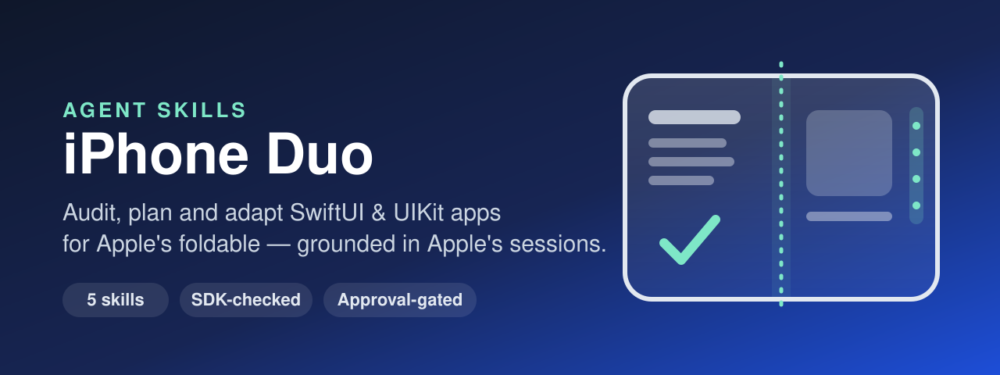

<p align="center">
  
</p>

# iPhone Duo Agent Skills

[](https://github.com/alexey1312/iPhone-Duo-Agent-Skill/actions/workflows/validate.yml)
[](LICENSE)
[](https://github.com/alexey1312/iPhone-Duo-Agent-Skill/releases)
[](https://github.com/alexey1312/iPhone-Duo-Agent-Skill/stargazers)

**Five coordinated Agent Skills that get SwiftUI and UIKit apps ready for iPhone Duo** —
the outer display, the regular-by-regular inner display, vertical bars, the hinge,
multiple displays and windows, and the two front cameras. They work in any AI coding
tool that supports the [Agent Skills open format](https://agentskills.io/home).

The skills turn Apple's six iPhone Duo tech talks, the *Designing for iPhone Duo*
guidelines, the *Preparing your app for iPhone Duo* guide and *Modernize your UIKit
app* (WWDC26) into a repeatable workflow: measure the project, check what the installed
SDK can actually compile, propose a tiered plan where every item cites the session and
timestamp (or documentation section) it comes from, and change code only after you
approve it.

**Website:** <https://blog.kakoulin.com/apps/iphone-duo-agent-skills>

## Who this is for

- iOS teams shipping on the iOS 27 / 27.1 SDK who need to know what breaks on iPhone Duo
- Apps with `UIScreen.main`, orientation or idiom checks that now misbehave in resizable
  environments — iPhone Duo, iPhone Mirroring on the Mac, iPhone apps on iPad
- Apps whose toolbars should work with iPhone Duo's vertical bars
- Reading, media, camera and creative apps that want to use the fold, the hinge and the
  outer display well

## What it checks

- **Launch blockers** — app lifecycle without UIScene, which no longer launches with the
  latest SDK
- **Legacy screen assumptions** — `UIScreen.main`, screen bounds as available space,
  idiom and orientation layout forks, global `keyWindow` / `connectedScenes.first`
- **Vertical bars** — standalone bars the system ignores, item order, titles and symbols,
  badges, axis behavior, overflow consolidation, visibility priority, compression, opt-out
- **Layout** — size classes on a regular-width iPhone, standard containers, sidebar
  placement, asymmetric safe areas, content spanning the fold, displacement, reserved
  regions, split and overlay arrangements
- **Displays and scenes** — hinge-driven interactions, Split View multitasking, scene
  requests that fail on the outer display, scene and camera capture accessories
- **Cameras** — the virtual front camera, cameras that change direction when the
  device opens or closes, preview mirroring and rotation
- **Device assumptions** — hard-coded Face ID copy and symbols (iPhone Duo has Touch
  ID), and whether the app exists in StandBy on the outer display at all (it needs a
  widget or Live Activity)
- **SDK reality** — which of those APIs exist in the Xcode you have, what each linked
  SDK gets on iPhone Duo, where Apple's sample code and the SDK disagree, and which
  behaviors the iPhone Duo simulator cannot verify at all

Every automated rule is listed with its source in [READINESS-CHECKS.md](READINESS-CHECKS.md).

## Plan before patch

Adapting an app for a new device touches layout everywhere, so the skills treat
“make it ready for iPhone Duo” as permission to investigate, not to rewrite.

Before anything changes, you get for every recommendation:

- A stable item ID you can approve
- The finding with `file:line`
- Why it matters on iPhone Duo
- The Apple session and timestamp it comes from
- Whether the selected SDK can compile it, or which SDK it is blocked on
- Risk, and how to verify it in Device Hub

Nothing is edited until you approve item IDs. Work is applied one tier at a time, rebuilt
and rescanned. Poses that could not be run are reported as *not run*, never as passed.

## How it works

Unlike text-only skills, this repository ships two read-only Python scripts, so your
agent reasons over structured JSON instead of ad-hoc grep output.

**When it triggers:**

- You ask to prepare, audit or test an app for iPhone Duo or the foldable iPhone.
- You mention vertical bars, the hinge, reserved regions, `ArrangementView`, scene
  accessories, `UIScreen.main`, orientation or idiom checks, or scene lifecycle migration.
- A build against the iOS 27 or 27.1 SDK shows your layout or toolbars misbehaving on
  the inner display.

**What you can ask:**

- `Audit this app for iPhone Duo and give me a tiered plan. Don't change anything yet.`
- `Which of the iPhone Duo APIs can I use with the Xcode I have installed?`
- `Get rid of UIScreen.main and orientation checks in the Editor module.`
- `Our toolbar has Select/Done, a compose button and a custom "more" menu — prepare it for vertical bars.`
- `The floating play button sits on the fold in book pose. Fix it.`
- `Show a teleprompter on the outer display while recording.`

**Under the hood:**

- `scripts/duo_scan.py` — walks Swift, Objective-C, Info.plist and build settings. Emits
  findings with stable IDs, severity, owning skill, session citation and advice, plus an
  inventory of the containers and APIs the project already uses. Skips dependencies,
  hidden directories and comments; never writes.
- `scripts/sdk_api_check.py` — reads the selected SDK's public headers and Swift
  interfaces and reports which iPhone Duo symbols exist, with their availability
  annotations. Code is never written against a symbol the compiler cannot see.
- Xcode's own modernization skill (`xcrun agent skills export`) is used for bulk UIKit
  rewrites when present; these skills cover SwiftUI, bars, the fold and displays.

## The skills

| Skill | What it does |
| --- | --- |
| [`iphone-duo-readiness`](skills/iphone-duo-readiness/SKILL.md) | Orchestrator: preflight, scan, SDK check, tiered plan, approval gate, apply through specialists, pose verification |
| [`iphone-duo-adaptivity-audit`](skills/iphone-duo-adaptivity-audit/SKILL.md) | Scene lifecycle, main screen, screen bounds, idiom, orientation, global window state, Face ID assumptions |
| [`iphone-duo-bars`](skills/iphone-duo-bars/SKILL.md) | Vertical bars: containers, ordering, titles and symbols, axis, overflow, priority, opt-out |
| [`iphone-duo-layout`](skills/iphone-duo-layout/SKILL.md) | Size classes, navigation containers, safe areas, corners, reserved regions, displacement, arrangements |
| [`iphone-duo-displays`](skills/iphone-duo-displays/SKILL.md) | Hinge interactions, Split View multitasking, multiple scenes, scene and camera capture accessories, camera direction, StandBy presence |

Start with `iphone-duo-readiness` for a whole app; call a specialist directly for a
focused question. Every skill carries its own copy of the shared references and scripts,
so any subset installs cleanly.

## How to Use These Skills

### Option A: Using skills.sh

Install all five with a single command:

```bash
npx skills add https://github.com/alexey1312/iPhone-Duo-Agent-Skill
```

Or just one:

```bash
npx skills add https://github.com/alexey1312/iPhone-Duo-Agent-Skill --skill iphone-duo-bars
```

Then use it in your AI agent, for example:

> Use the iPhone Duo readiness skill and give me a tiered plan for this app.

### Option B: Claude Code Plugin

#### Personal Usage

1. Add the marketplace:

```bash
/plugin marketplace add alexey1312/iPhone-Duo-Agent-Skill
```

2. Install the plugin:

```bash
/plugin install iphone-duo-skills@iphone-duo-skills
```

#### Project Configuration

To provide the skills to everyone working in a repository, configure the repository's
`.claude/settings.json`:

```json
{
  "enabledPlugins": {
    "iphone-duo-skills@iphone-duo-skills": true
  },
  "extraKnownMarketplaces": {
    "iphone-duo-skills": {
      "source": {
        "source": "github",
        "repo": "alexey1312/iPhone-Duo-Agent-Skill"
      }
    }
  }
}
```

When team members open the project, Claude Code will prompt them to install the plugin.

### Option C: Codex / OpenAI-compatible tools

This repository includes an `agents/openai.yaml` manifest. Copy or symlink the skill
folders into your Codex skills directory:

```bash
cp -R skills/iphone-duo-* "$CODEX_HOME/skills/"
```

See the [Codex skills documentation](https://developers.openai.com/codex/skills/) for
details on where to save skills.

### Option D: Using pi package manager

Install via [pi](https://github.com/badlogic/pi-mono):

```bash
pi install https://github.com/alexey1312/iPhone-Duo-Agent-Skill
```

### Option E: Manual install

1. **Clone** this repository.
2. **Install or symlink** the folders under `skills/` following your tool's official
   skills installation docs (see links below).
3. **Ask your AI tool** to use the `iphone-duo-readiness` skill on your project.

Or download a single `.skill` archive from the
[latest release](https://github.com/alexey1312/iPhone-Duo-Agent-Skill/releases/latest).

#### Where to Save Skills

- **Codex:** [Where to save skills](https://developers.openai.com/codex/skills/#where-to-save-skills)
- **Claude:** [Using Skills](https://docs.claude.com/en/docs/agents-and-tools/agent-skills/overview)
- **Cursor:** [Enabling Skills](https://cursor.com/docs/context/skills#enabling-skills)

**How to verify:**

Your agent should run the bundled scan and SDK check first, present a tiered plan with
item IDs and session timestamps, and wait for you to approve items before editing.
With Xcode 27.0 it should mark iOS 27.1 APIs as blocked; with Xcode 27.1 it should
report them as available and name the `if #available(iOS 27.1, *)` gate they need when
your deployment target is lower.

## Skill Structure

```text
skills/
  iphone-duo-readiness/         Orchestrator workflow, tiers, approval gate
  iphone-duo-adaptivity-audit/  + references/legacy-api-remediation.md
  iphone-duo-bars/              + references/vertical-bars.md
  iphone-duo-layout/            + references/layout-code.md
  iphone-duo-displays/          + references/displays-code.md
    SKILL.md                    Workflow and rules for the skill
    references/                 sources, api-availability, recommendation-format,
                                pose-test-matrix, device-geometry (shared copies)
    scripts/                    duo_scan.py, sdk_api_check.py (shared copies)
    evals/                      skill-creator evals and fixture projects
references/                     Canonical shared references
scripts/                        Canonical scripts and sync_skill_copies.py
tests/                          Deterministic unit tests
benchmarks/                     skill-creator benchmark results
READINESS-CHECKS.md             Every automated and manual check, with sources
```

## This skill's approach

- **Grounded**: every recommendation cites an Apple session and timestamp; anything else
  is labelled as inference.
- **SDK-honest**: the installed SDK decides what can be written. Talk samples that
  disagree with it are called out — `barMinimizationBehavior` versus
  `navigationBarMinimization`, `UIWindowSceneActivationAction` versus
  `UIWindowScene.ActivationAction`. It cuts both ways: running the bundled checker
  against the real 27.1 SDK is what caught it reporting
  `builtInOuterUltraWideCamera` as missing when AVFoundation declares it — under an
  Objective-C name the importer hides.
- **Token efficient**: one scan returns compact JSON instead of dozens of exploratory
  searches, and each skill loads only the references it needs.
- **Respectful of your decisions**: documented, deliberate orientation or idiom reads are
  reported as *kept*, not rewritten.
- **Safe by design**: read-only by default, one tier at a time, rebuild and rescan after
  every change.

## Sources

- [Prepare your app for iPhone Duo](https://developer.apple.com/videos/play/tech-talks/111461/) — Tech Talk
- [Raise the bar with iPhone Duo](https://developer.apple.com/videos/play/tech-talks/111462/) — Tech Talk
- [Strike a pose with adaptive layouts on iPhone Duo](https://developer.apple.com/videos/play/tech-talks/111463/) — Tech Talk
- [Leverage multiple displays and scenes on iPhone Duo](https://developer.apple.com/videos/play/tech-talks/111464/) — Tech Talk
- [Build a great camera experience for iPhone Duo](https://developer.apple.com/videos/play/tech-talks/111465/) — Tech Talk
- [Design for iPhone Duo](https://developer.apple.com/videos/play/tech-talks/111466/) — Tech Talk
- [Designing for iPhone Duo](https://developer.apple.com/design/human-interface-guidelines/designing-for-iphone-duo) — Human Interface Guidelines
- [Preparing your app for iPhone Duo](https://developer.apple.com/documentation/technologyoverviews/preparing-your-app-for-iphone-duo) — Apple documentation, with the API pages it links (reserved regions, arrangements, hinge, vertical bars, scene accessories)
- [Choosing a camera by the direction it faces](https://developer.apple.com/documentation/avkit/choosing-a-camera-by-the-direction-it-faces) and [Registering a camera capture accessory on iPhone Duo](https://developer.apple.com/documentation/avfoundation/registering-a-camera-capture-accessory-on-iphone-duo) — Apple documentation
- [TN3192: Migrating from the deprecated UIRequiresFullScreen key](https://developer.apple.com/documentation/technotes/tn3192-migrating-your-app-from-the-deprecated-uirequiresfullscreen-key) — Apple technote
- [iPhone Duo tech specs](https://www.apple.com/iphone-duo/specs/) and [App Store Connect screenshot specifications](https://developer.apple.com/help/app-store-connect/reference/app-information/screenshot-specifications) — hardware facts and display sizes in `references/device-geometry.md`
- [Modernize your UIKit app](https://developer.apple.com/videos/play/wwdc2026/278/) — WWDC26
- [Xcode 27.1 beta release notes](https://developer.apple.com/documentation/xcode-release-notes/xcode-27_1-release-notes) — the iPhone Duo simulator, and the known issues that limit what it can verify
- [Apple Design Resources](https://developer.apple.com/design/resources/) — iOS & iPadOS 27 UI Kit and the iPhone Duo product bezel

Chapter-level notes: [references/sources.md](references/sources.md).

## Contributing

Contributions are welcome — especially SDK updates when a new Xcode ships, and false
positives found on real projects. Please read [CONTRIBUTING.md](CONTRIBUTING.md).

## About the author

Created by [Aleksei Kakoulin](https://github.com/alexey1312). Packaging follows Antoine
van der Lee's [Xcode Build Optimization](https://github.com/AvdLee/Xcode-Build-Optimization-Agent-Skill)
and [Xcode Disk Cleanup](https://github.com/AvdLee/Xcode-Disk-Cleanup-Agent-Skill) Agent
Skills. iPhone Duo guidance is Apple's; this project is not affiliated with Apple.

## License

This project is open-source and available under the MIT License. See [LICENSE](LICENSE)
for details.
